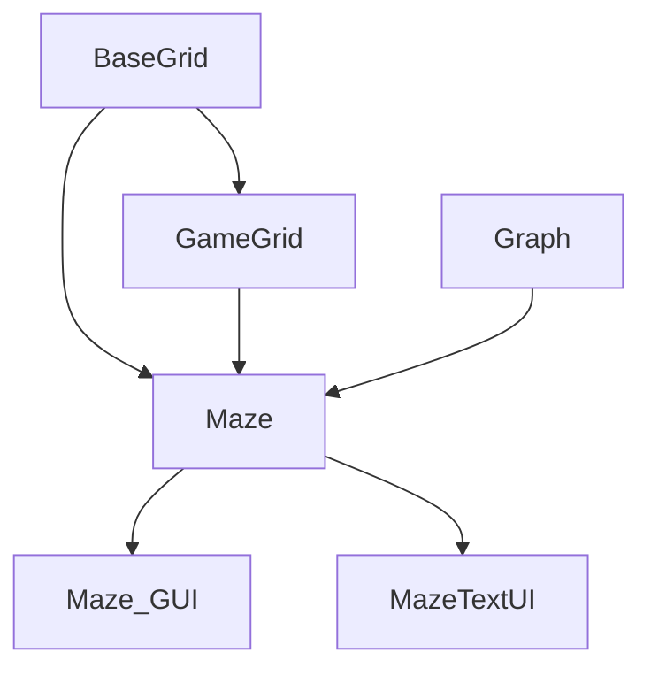
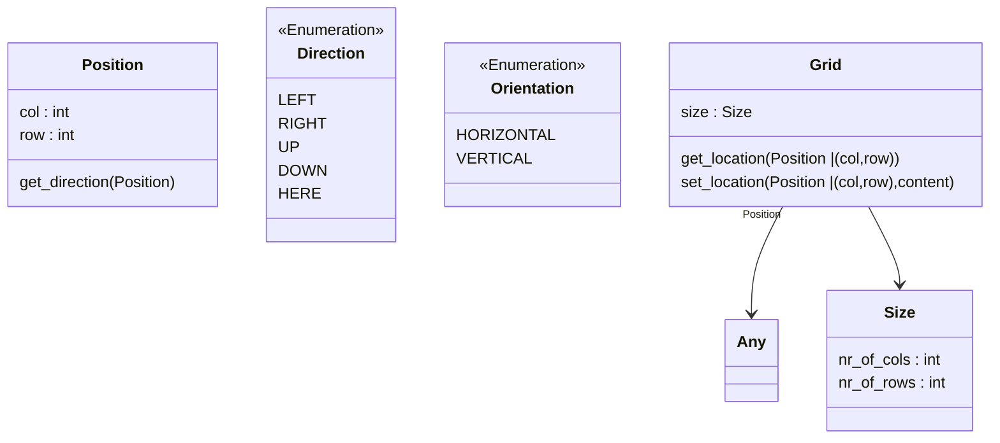
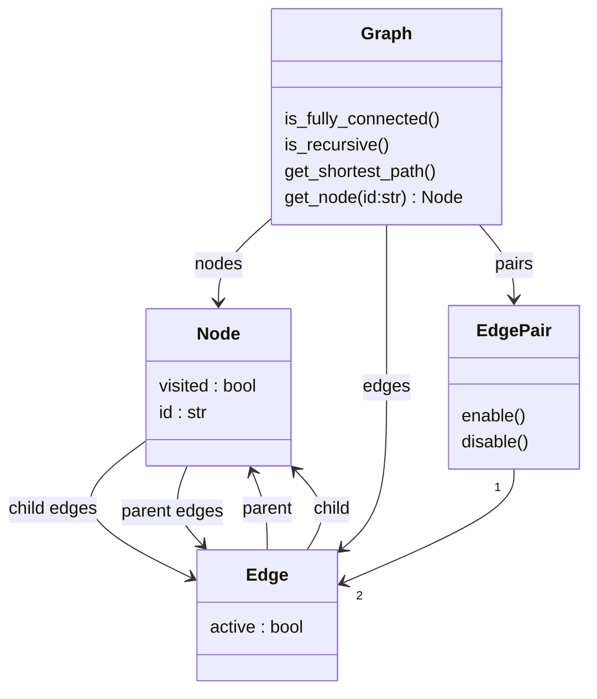
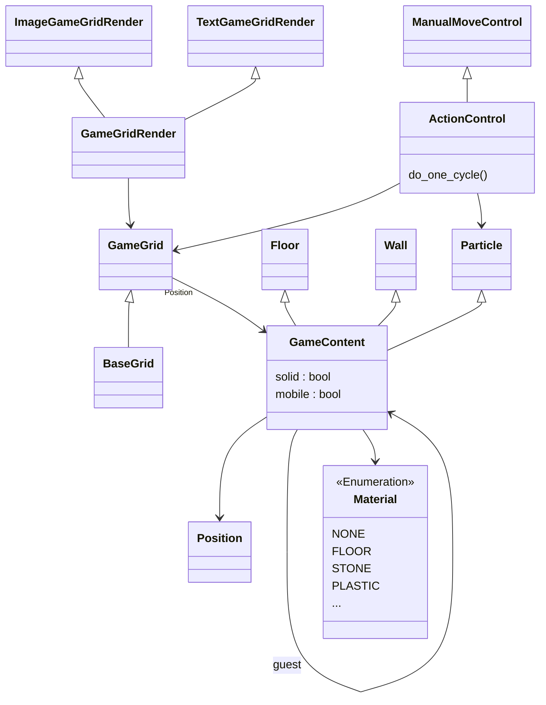
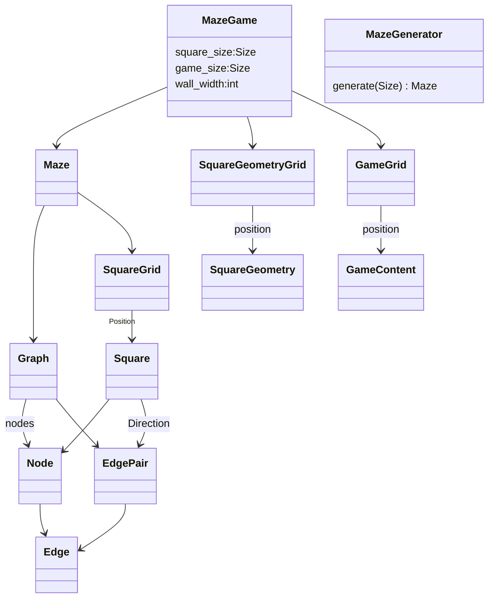

# Maze datamodels

## Overview of Modules

```mermaid
  graph TD;
    BaseGrid --> Maze
    BaseGrid --> GameGrid
    GameGrid --> Maze
    Graph  --> Maze
    Maze --> Maze_GUI
    Maze --> MazeTextUI

```

## BaseGrid

```mermaid
  classDiagram

    class Position {
        col : int
        row : int
        get_direction(Position)
    }
    class Size {
        nr_of_cols : int
        nr_of_rows : int
    }

    class Direction {
        <<Enumeration>>
        LEFT
        RIGHT
        UP
        DOWN
        HERE
    }

    class Orientation {
        <<Enumeration>>
        HORIZONTAL
        VERTICAL
    }

    Grid "Position" -->  Any
    Grid --> Size

    class Grid {
        size : Size
        get_location(Position | (col,row))
        set_location(Position | (col,row),content)
    }


```

## Graph

```mermaid
  classDiagram

    class Graph {
        is_fully_connected()
        is_recursive()
        get_shortest_path()
        get_node(id:str) Node
    }
    class Node {
        visited : bool
        id : str
    }
    class Edge {
        active : bool
    }
    class EdgePair {
        enable()
        disable()
    }

    Graph  --> Node : nodes
    Graph -->  Edge : edges
    Graph -->  EdgePair : pairs
    
    Node  -->  Edge : child edges
    Node  -->  Edge : parent edges

    Edge  -->  Node : parent
    Edge  -->  Node : child

    EdgePair "1" --> "2" Edge


```
## GameGrid

```mermaid
  classDiagram
    class Material {
        <<Enumeration>>
        NONE
        FLOOR
        STONE
        PLASTIC
        ...
    }

    class GameContent {
        solid : bool
        mobile : bool
        
    }
    class GameGrid {
        
    }

    GameGrid <|-- BaseGrid

    GameGrid "Position" -->  GameContent
    GameContent --> Position
    GameContent --> GameContent : guest
    GameContent --> Material


    class Floor {
    }
    class Wall {
    }
    class Particle {
    }
    

    Floor <|-- GameContent
    Wall <|-- GameContent
    Particle <|-- GameContent

    GameGridRender --> GameGrid
    ImageGameGridRender <|-- GameGridRender
    TextGameGridRender <|-- GameGridRender
    
    class ActionControl {
        do_one_cycle()
    }
    ActionControl --> GameGrid
    ActionControl --> Particle
    ManualMoveControl <|-- ActionControl
    

```

## Maze

```mermaid
  classDiagram
    class MazeGame {
        square_size:Size
        game_size:Size
        wall_width:int
    }


    Graph  --> Node : nodes
    Node --> Edge
    EdgePair --> Edge 
    Graph --> EdgePair

    class Square {
        
    }

    class MazeGenerator {
        generate(Size) Maze
    }


    Maze --> Graph
    MazeGame --> Maze
    MazeGame --> SquareGeometryGrid
    MazeGame --> GameGrid
    SquareGeometryGrid --> SquareGeometry : position
    Maze --> SquareGrid
    

    SquareGrid "Position" -->  Square
    Square --> Node
    Square --> EdgePair : Direction
    
    
    
    
    GameGrid --> GameContent : position


```
