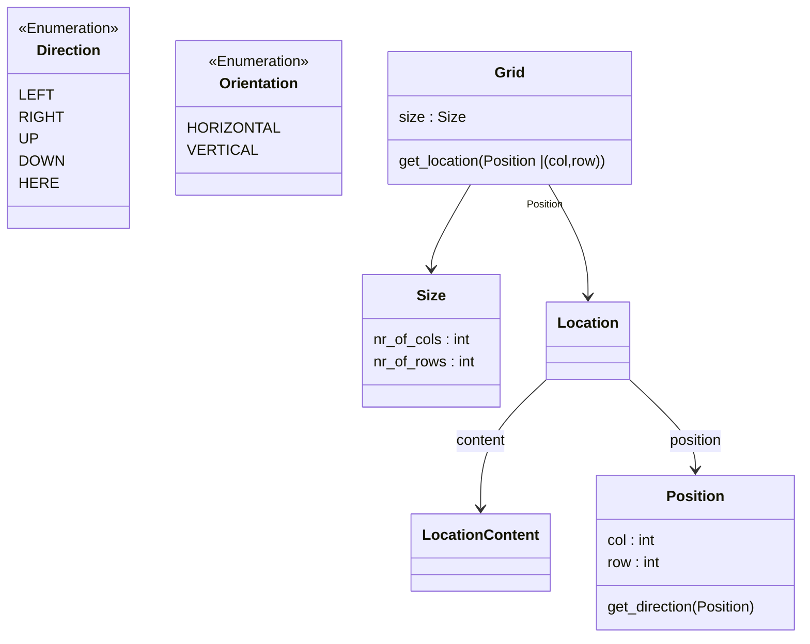
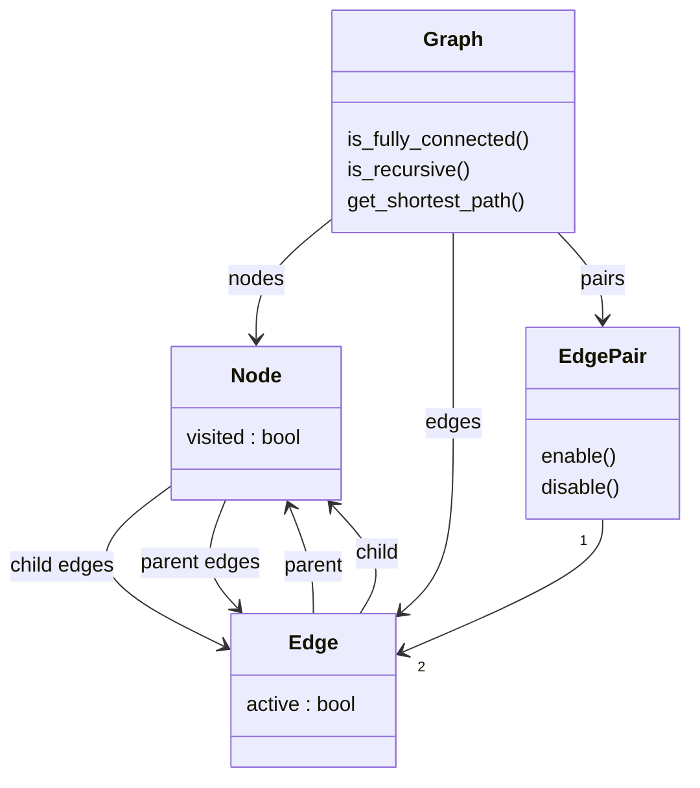
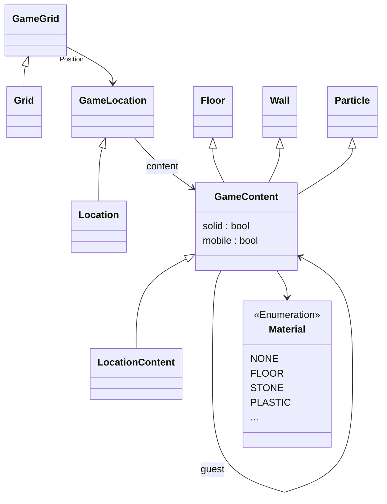
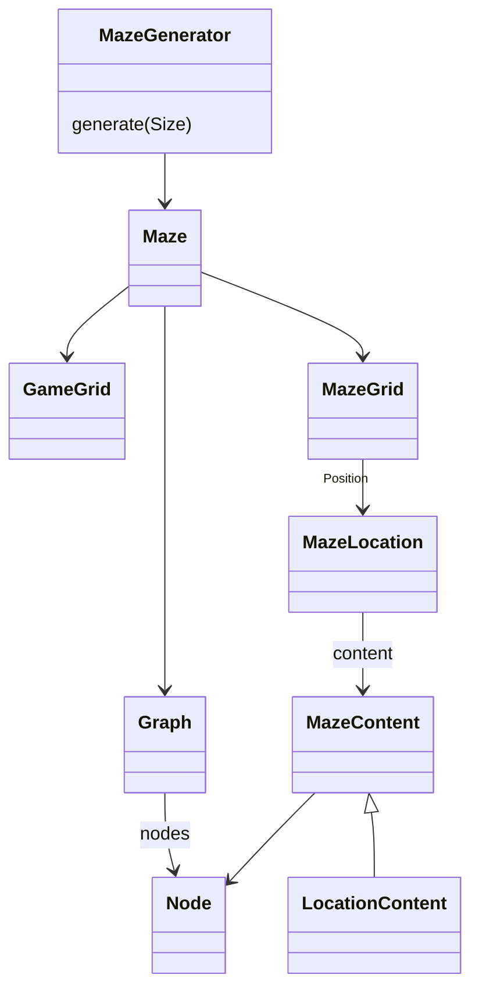

# Maze datamodels

## Overview of packages

```mermaid
  graph TD;
    BaseGrid --> Maze
    BaseGrid --> GameGrid
    GameGrid --> Maze
    Graph  --> Maze
    Maze --> MazeQTUI
    Maze --> MazeTextUI

```

## BaseGrid

```mermaid
  classDiagram

    class Position {
        col : int
        row : int
        get_direction(Position)
    }
    class Size {
        nr_of_cols : int
        nr_of_rows : int
    }

    class Direction {
        <<Enumeration>>
        LEFT
        RIGHT
        UP
        DOWN
        HERE
    }

    class Orientation {
        <<Enumeration>>
        HORIZONTAL
        VERTICAL
    }

    class Location {
        
    }
    class LocationContent {
        
    }
    Location --> LocationContent : content
    Location --> Position : position
    
    Grid "Position" -->  Location
    Grid --> Size

    class Grid {
        size : Size
        get_location(Position | (col,row))
    }


```

## Graph

```mermaid
  classDiagram

    class Graph {
        is_fully_connected()
        is_recursive()
        get_shortest_path()
    }
    class Node {
        visited : bool
    }
    class Edge {
        active : bool
    }
    class EdgePair {
        enable()
        disable()
    }

    Graph  --> Node : nodes
    Graph -->  Edge : edges
    Graph -->  EdgePair : pairs
    
    Node  -->  Edge : child edges
    Node  -->  Edge : parent edges

    Edge  -->  Node : parent
    Edge  -->  Node : child

    EdgePair "1" --> "2" Edge


```
## GameGrid

```mermaid
  classDiagram
    class Material {
        <<Enumeration>>
        NONE
        FLOOR
        STONE
        PLASTIC
        ...
    }

    class GameLocation {
        
    }
    class GameContent {
        solid : bool
        mobile : bool
        
    }
    class GameGrid {
        
    }

    GameGrid <|-- Grid
    GameLocation <|-- Location
    GameContent <|-- LocationContent


    GameGrid "Position" -->  GameLocation
    GameLocation --> GameContent : content
    
    GameContent --> GameContent : guest
    GameContent --> Material


    class Floor {
    }
    class Wall {
    }
    class Particle {
    }

    Floor <|-- GameContent
    Wall <|-- GameContent
    Particle <|-- GameContent


``` 

## Maze

```mermaid
  classDiagram
    class Maze {
        
    }

    class Graph {

    }
    class Node {

    }

    Graph  --> Node : nodes


    class MazeGenerator {
        generate(Size)
    }

    class GameGrid {

    }

    Maze --> Graph
    Maze --> GameGrid
    Maze --> MazeGrid
    MazeGenerator --> Maze

    class MazeLocation {
        
    }
    class MazeContent {
        
        
    }
    class MazeGrid {
        
    }

    MazeGrid "Position" -->  MazeLocation
   %% MazeGrid <|-- Grid
   %% MazeLocation <|-- Location 
    MazeContent <|-- LocationContent
    
    MazeLocation --> MazeContent : content

    MazeContent --> Node

```