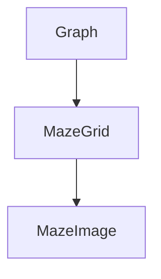
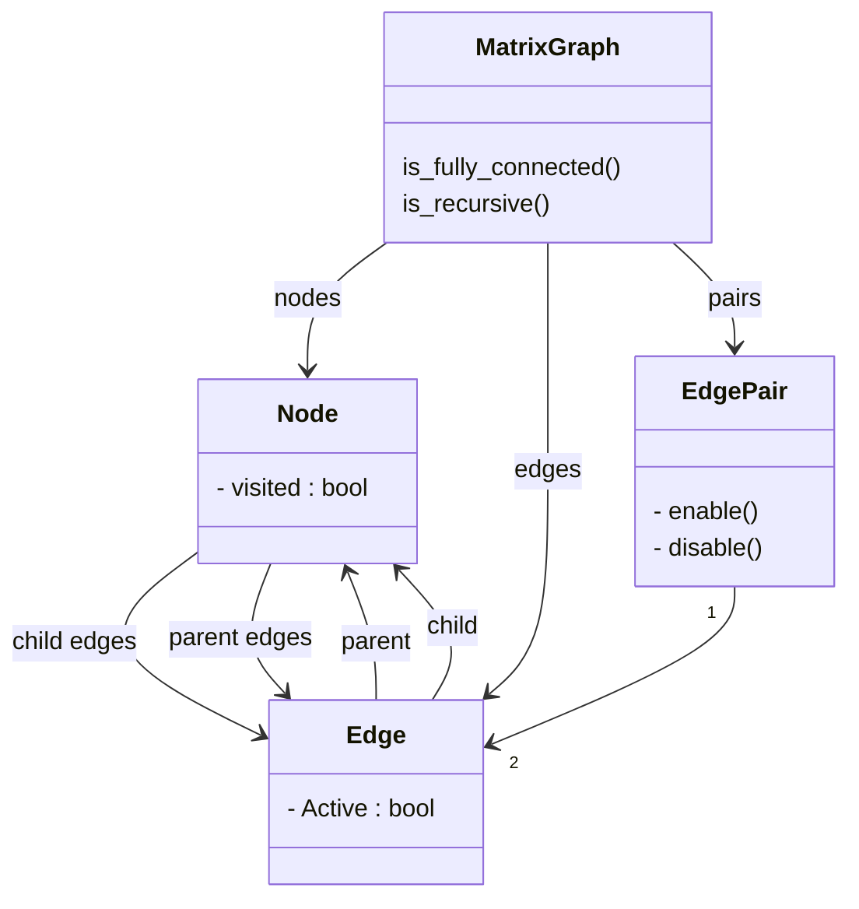

# Maze datamodels

## Overview of layers

```mermaid
  graph TD;
      Graph --> MazeGrid
      MazeGrid --> MazeImage
```

## Graph layer

```mermaid
  classDiagram

    class MatrixGraph {
        is_fully_connected()
        is_recursive()
    }
    class Node {
        - visited : bool
    }
    class Edge {
        - Active : bool
    }
    class EdgePair {
        - enable()
        - disable()
    }

    MatrixGraph  --> Node : nodes
    MatrixGraph -->  Edge : edges
    MatrixGraph -->  EdgePair : pairs
    
    Node  -->  Edge : child edges
    Node  -->  Edge : parent edges

    Edge  -->  Node : parent
    Edge  -->  Node : child

    EdgePair "1" --> "2" Edge


```
