# Maze datamodels

## Overview of Modules

## BaseGrid

## Graph

## GameGrid

## Maze

### Maze Behavior

### Maze Behavior State Machine

#### Options

**Option 1:** Separate states for start end end in cycle

**Option 2:** One state handles start and end cycle

### Maze Behavior Rule engine

```mermaid
flowchart LR

    subgraph Decide
        direction TB
        subgraph MoveInfo
            direction TB
            has_available --> 
            has_new_available --> 
            has_new
        end

        subgraph Router
            direction TB
            has_route
        end
        
        is_route_follow_possible -->
        is_standing_still -->
        
        has_coordinator -->
        is_following_coordinator -->
        coordinator_has_suggestion -->
        coordinator_has_new_pos -->
        coordinator_has_new_target -->
        coordinator_has_new_route  -->
        previous_action
    end

    subgraph Action
        direction TB
        subgraph Router
            direction TB
            set_route -->
            set_route_to_route --> 
            freeze_route -->
            reset_route
        end

        add_to_do_head -->
        add_to_do_tail -->
        get_next_to_do -->
        notify_coordinator
    end

    subgraph NewMove
        direction TB
        subgraph Router
            direction TB
            get_new_pos
        end
        subgraph MoveInfo
            direction TB
            get_random_available
            get_random_new_available
        end
        StandStill -->
        ClockWiseMove -->
        CoordinatedMove
    end
    
    
    Decide --> Action
    Action --> Decide
    Action --> NewMove
    Decide --> NewMove

```

