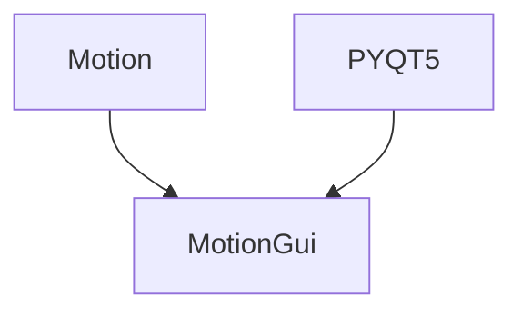
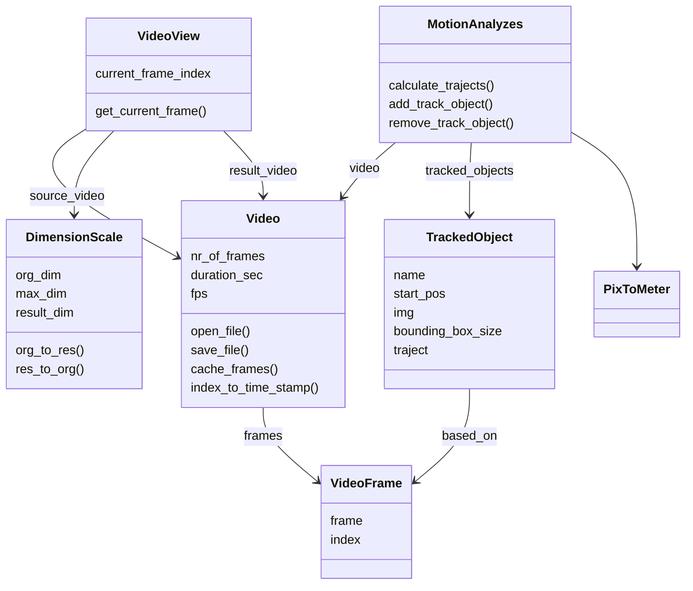
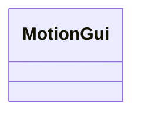

# Video object detection

Given a short video this program can be used to analyze the motion of objects in the video.

## Overview

```mermaid
  graph TD;
    Motion --> MotionGui
    PYQT5 --> MotionGui

```

## Motion

```mermaid
  classDiagram

    class Video {
        nr_of_frames
        duration_sec
        fps

        open_file()
        save_file()
        cache_frames()
        index_to_time_stamp()
    }

    class VideoFrame {
        frame
        index
    }

    Video --> VideoFrame : frames


    class MotionAnalyzes {

        calculate_trajects()
        add_track_object()
        remove_track_object()
        
    }

    class TrackedObject {
        name
        start_pos
        img
        bounding_box_size
        traject
    }

    class VideoView {
        current_frame_index
        get_current_frame()
    }

    class DimensionScale {
        org_dim
        max_dim
        result_dim

        org_to_res()
        res_to_org()
    }

    VideoView --> Video : source_video
    VideoView --> DimensionScale
    VideoView --> Video : result_video

    TrackedObject --> VideoFrame :based_on
    MotionAnalyzes --> Video: video
    MotionAnalyzes  --> TrackedObject :tracked_objects
    MotionAnalyzes --> PixToMeter

```

## MotionGui

```mermaid

  classDiagram

    class MotionGui {


    }


```